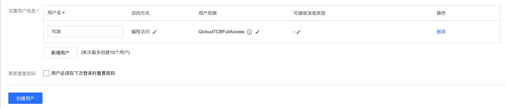

# 云开发示例简易商城-微信云托管部署版本

## 一、项目简介：
- 本项目是简化版商城，保留商城的主体逻辑，去除了一些复杂的功能。通过此项目可以熟悉云开发的云函数、云数据库操作。
- 项目没有后台管理功能，商品详情以及图片均来自互联网。
- 项目内付款操作为模拟付款，没有真正的引入付款功能，云开发集成微信支付能力，可以轻松使用。

## 二、部署步骤：
- 将项目源码在小程序开发者工具中打开，填写自己的小程序appid
- 开通微信云开发环境，记录云开发环境ID，并创建goods、order两个数据库集合。
- 这里为什么要云开发环境，你在微信云托管（注意不是云开发内云托管）环境中，没有mongo云数据库，另外当前也不支持存储，所以需要借用云开发环境的存储资源。
- 将根目录data.json文件导入到goods集合中，此中包含两个示例商品（来自锤子商城）
- 登录小程序开发者后台，设置服务类目为【企业管理】，订阅消息选择3520，名称为【新订单提醒】
- 订阅消息项目选择订单号、订单状态、订单备注三项，创建保存模版id
- 浏览器访问[此网址](https://cloud.tencent.com/login/mp?s_url=https%3a%2f%2fconsole.cloud.tencent.com%2fcam%2fuser%2fcreate%3fsystemType%3dFastCreateV2),使用微信授权当前小程序进入腾讯云官网控制台，设置编程用户
- 如下图设置相关编程用户，创建后获取API密钥信息SecretId和SecretKey
- 
- 打开cloudcontainer/server/work/key.json，将SecretId、SecretKey、模版id、云开发envId填写到json里
- 参照[官方文档](https://developers.weixin.qq.com/miniprogram/dev/wxcloudrun/src/basic/guide.html)，从第二步骤开始，选择cloudcontainer下的server文件夹上传部署云托管。服务名称随便填，记得在下一步保持一致，监听端口写3000
- 版本部署完并全量后，在miniprogram目录app.js文件前3行，填写订阅消息模版ID、微信云托管环境和服务信息
- 前往[控制台](https://cloud.weixin.qq.com/cloudrun/openapi)，设置微信权限令牌，填入`/cgi-bin/message/subscribe/send`，并保存
- 重新启动预览小程序即可体验。

## 三、开发注意
- 作者将所有对外数据交互的操作均放在app.js中，可以直接在此文件夹中更换相应后台。
- 本项目页面构建以及页面逻辑是参照其他项目直接迁移的，在代码规则以及安全性方面有些瑕疵，如果你想搭建自己的商城，请根据业务需求自行完善。
- 本项目所有内容只可作为学习交流使用，不可用于商业化

## 四、作者信息
- 李冠宇zirali 腾讯云·云开发团队